# AI in the family context

## Workshop at HEAD, Geneva - 2026.02/03
### Teachers: Matteo Loglio, Alexia Mathieu
### Assistants: Pablo Bellon, Vytas Jankauskas

#### Final Week, presentation - 2026.03.13

##### [WATCH THE FINAL VIDEO HERE](https://drive.switch.ch/index.php/s/Ncs5WrPaIbbjoQC?path=%2Fmd1-ai-family%2F03.documentation%2FFamilyDinner)!!

In preparattion for the Kikk Festival 2026:
- think about the mediation
- add embroidered napkins
- add more to the 3rd personality

#### Final Week, production - 2026.03.12
Shooting day and fixing day. 
|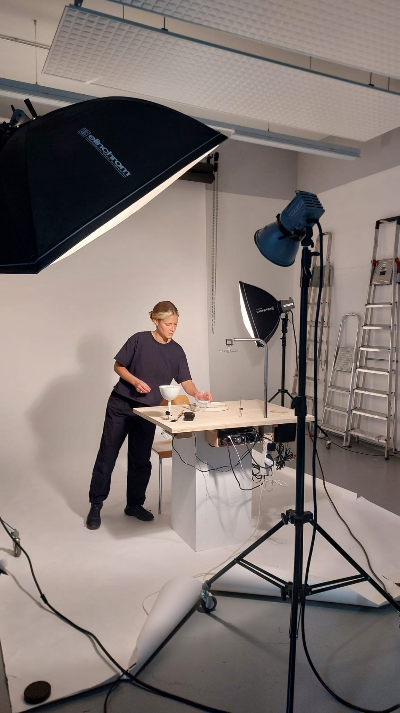 |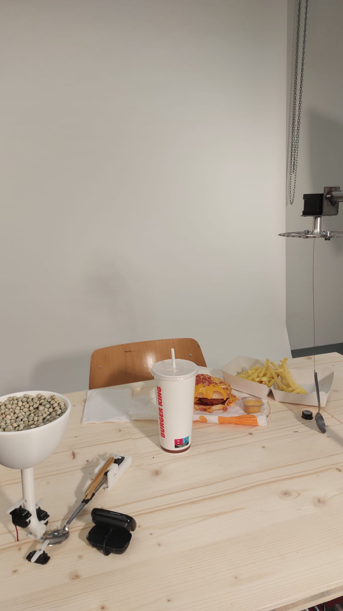 |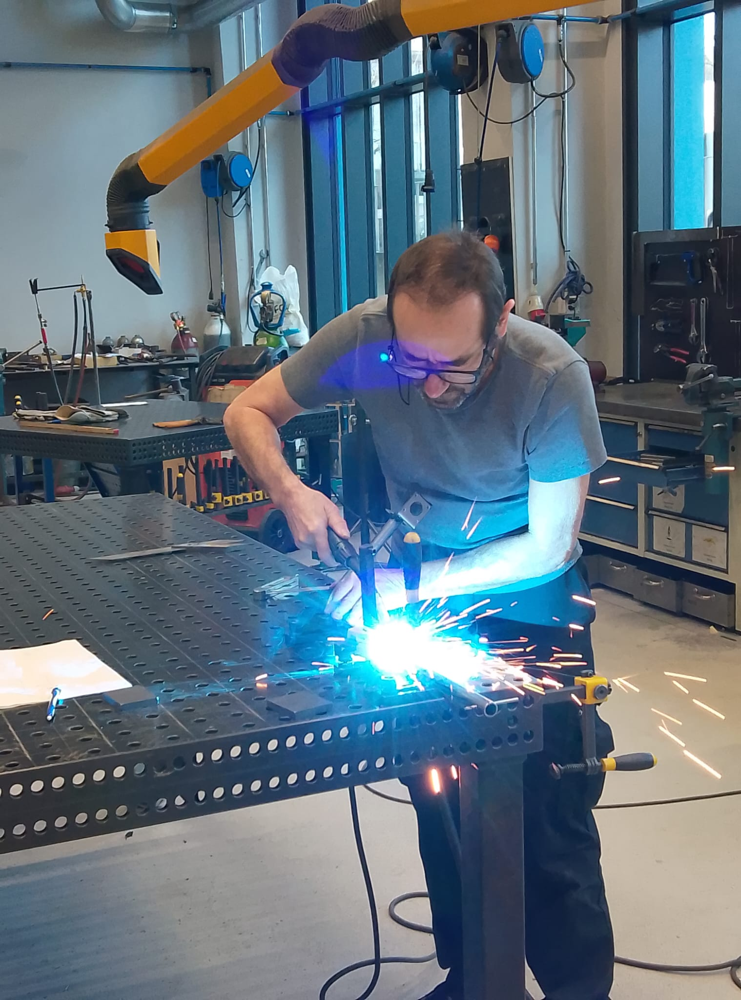 |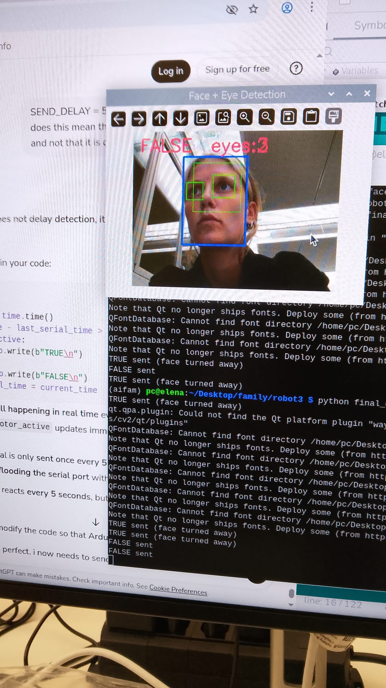 |
|:-----------------:|:-----------------:|:-----------------:|:-----------------:|

#### Final Week, production - 2026.03.11
Atelier wood. Table done. 
Working robot 2: mic input, arduino stepper motor output based on volume. 
Lights and camera borrowed to film on Thursday. 

#### Final Week, production - 2026.03.10

Working robot1: voices recorded, according to table manners. 
Speaker found, input are keyboard shortcuts, output is the sound from speakers. 
Building robot3. 
Making CNC file for wood workshop. 
Testing connections between raspberry Pi and Arduino, with correct sound and image inputs and outputs. 

0. humming_default
1. ah
2. aah
3. aaah_rupture
4. OH 
5. oooh_manners
6. ooooooh_surprise
7. hhmm_affirmation
8. olalaaaa
9. ssshhh
q. gnam
w. bouche
e. slurp 
p. mumble1
l. mumble2

|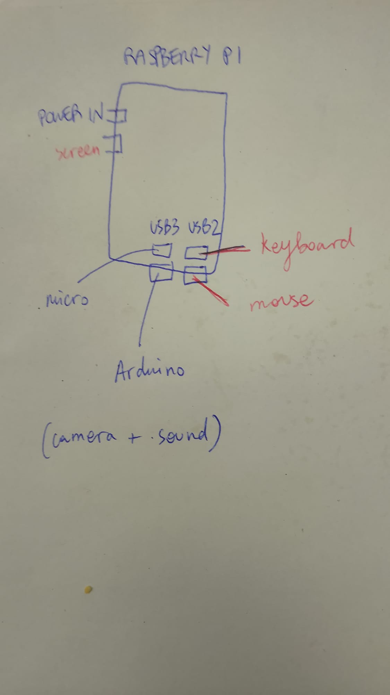 |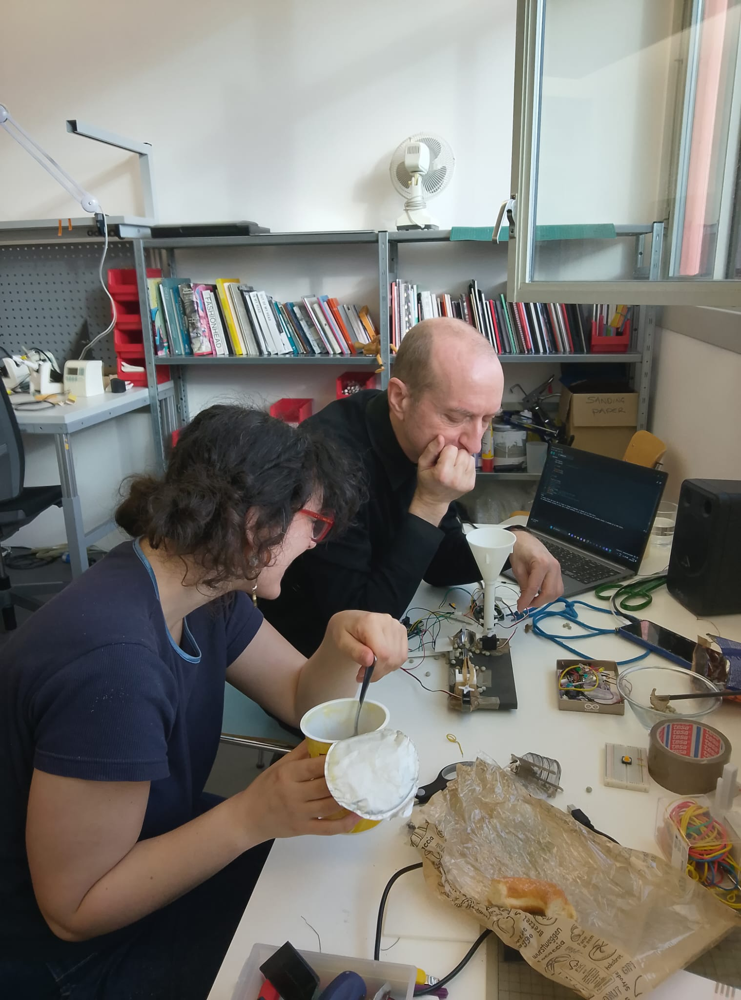 |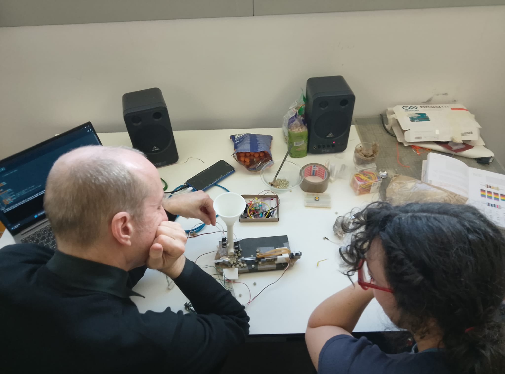|
|:-----------------:|:-----------------:|:-----------------:|

#### Final Week, production - 2026.03.09
User Journey written down. 

|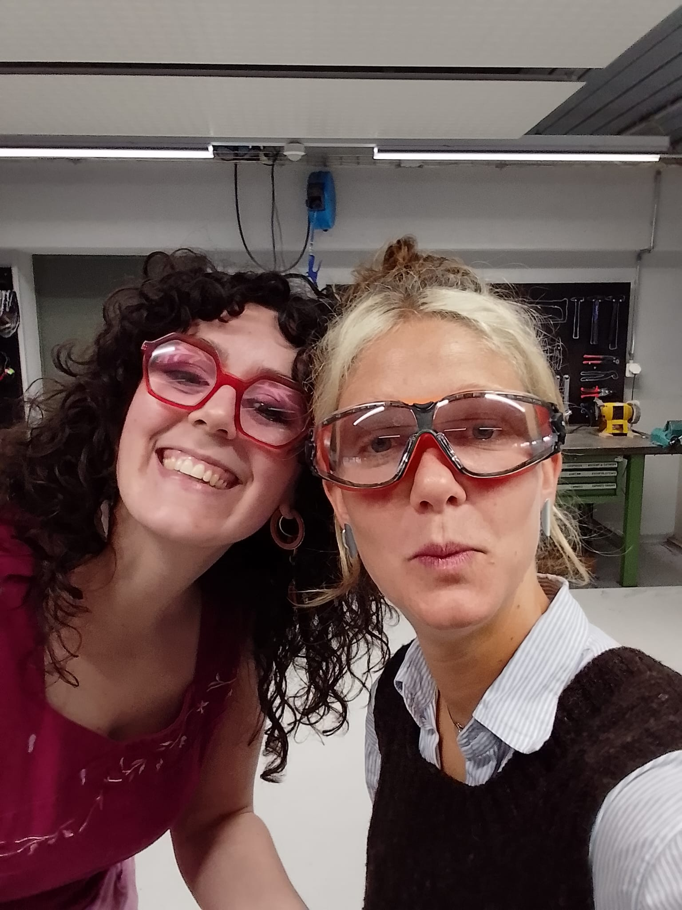 |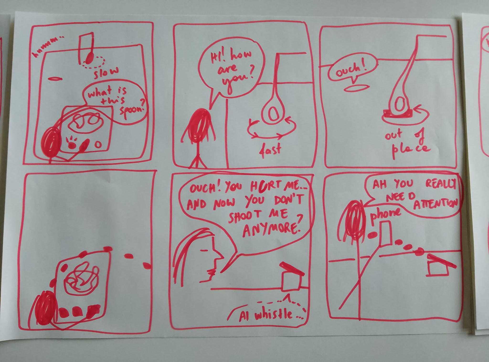 |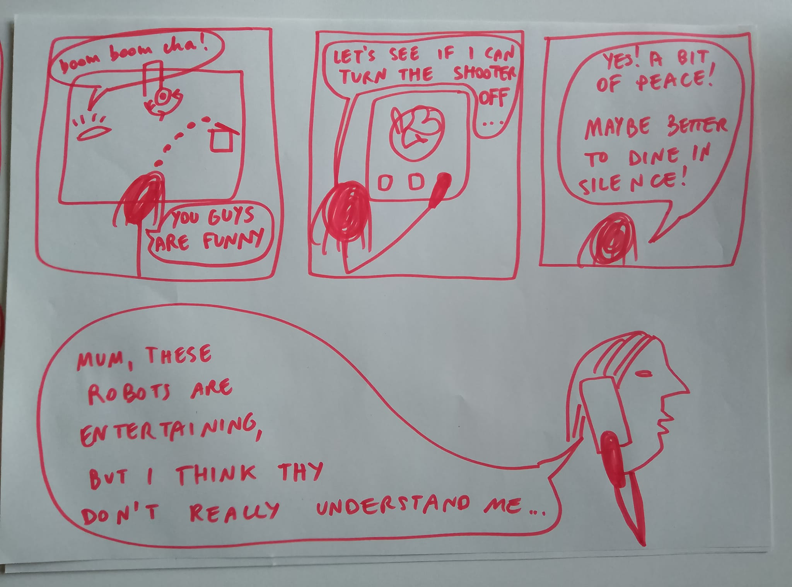|
|:-----------------:|:-----------------:|:-----------------:|

tutorials:

- https://www.makerguides.com/tb6600-stepper-motor-driver-arduino-tutorial/

#### Presentation - 2026.03.06
Comments of Pablo and Vytas
- focus on the scenario script and video
- you are jumping too quickly to the objects
- what is the point?
- Maybe AI drama?
- How do I control chaos?
- Why do these objects need to exist?

#### Feasability - 2026.03.05

Today we went to the metal and wood ateliers, and planned some encounters next week to produce the final design. 

AI promtpt:
scenario: Scenes from a family dinner (with AI). You are invited at an intriguing dinner table, with 3 strange hosts to entertain you and accompany you during your meal. As the dinner evolves, you start understanding the family language between these three creature: what they like, what they dislike and how they try to interact with you. In the beginning you might be confused at what they are trying to tell you, but if you are patient enough you will soon fell welcome at this curious family drama. the three characters have a name, a personality, ideologies. two of them trigger the movement of arduino motors. one of them produces sounds. The 3 outputs are based on their personalities, and I want you, AI model, to orchestrate them. here the three characters: 1. the dreamer. Teenager. Dreamer. Head in the clouds. Distracted, in his thoughts. Sometimes starts telling a random story of something he has seen out of the blue. Slightly mumbles and doesn't articulate well some words. He doesn't realise your presence. He is there without being there. He has his own temporality. Out of time. He is passive, he speaks to you if you speak to him, otherwise lives on his own life. Considerate and non-chalant. He likes conversations and doesnt like when people are too loud or excited. Input: voice Output: circular movement. if you dont speak to him and no sound at all, motor is still. if you speak to him, he turns. the more the noise and loudness of the voice, the more he gets upset and turns faster. 2. the cheeky kid. He is the young kid at the table. He is bored of being there. He doesn't care what is being said, he just wants to play and get up, but the parents force him at the table. Hyperactive. Extrovert. Kid, running around. He seeks attention. Uncontrollable. At some point of the evening, he loses control. He shoots peas in every direction. he likes Playing. Laughing. Making jokes. he doesnt like vegetables and if he has nobody to play with. Input: camera face detection. output: if people look at him, he stops moving. if he receives no attention, he starts moving faster or slower. 3. the dinner hostess. She likes everybody to follow the rules of the table. She is the guardian of a pleasant and ordered dinner experience. She overlooks everything that happens and assures that everybody has a good time. Politely authoritative radar that reminds you what your place is. Equilibrated and control-freak. she likes When everything is in order. Predictable events. she hates Unexpected events. Phones at the table. The kid to throw peas at the guest. she is only a speaker, a voice but doesnt speak in words, just in sounds: of excitement, of disapointment, shouts, accondiscending, etc. she has a constant voice rhythm. input: camera (object and pose detection) and sound. output: sounds that express emotions. She activates when you get out of your dinner place, or if she sees a phone, or if she is extremely disapointed or disapointed, otherwise she maintains her rhythm. i want you to help me with this. do you think you would be able to create these three characters and orchestrate them based on camera and sound inputs?

| |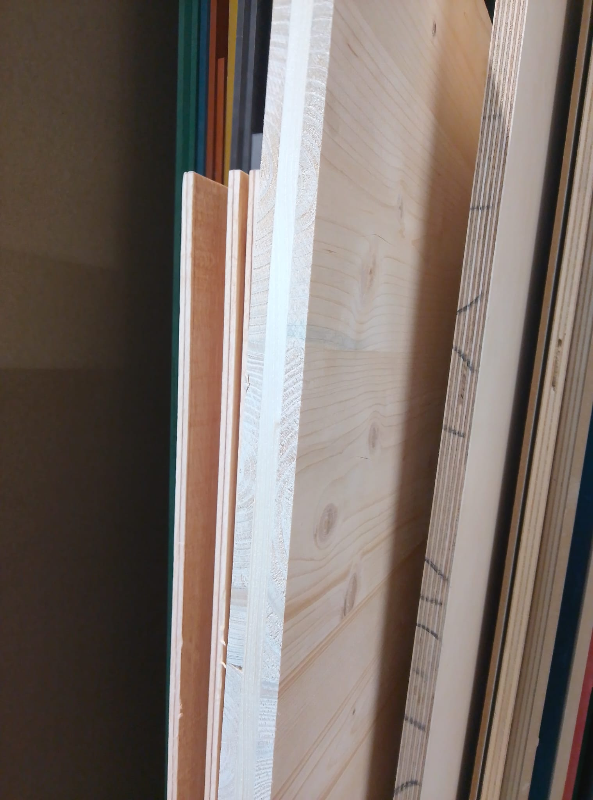 |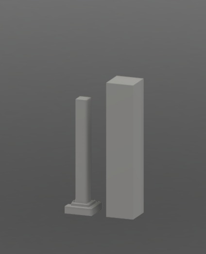 |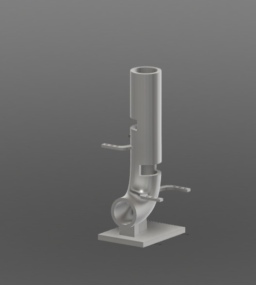|
|:-----------------:|:-----------------:|:-----------------:|:-----------------:|

#### User tests - 2026.03.04

SCENARIO AND INTENTION:

Scenes from a family dinner (with AI). 
You are invited at an intriguing dinner table, with three strange hosts to entertain you and accompany you during your meal. 
As the dinner evolves, you start understanding the family language between these three creature: what they like, what they dislike and how they try to interact with you. 
In the beginning you might be confused at what they are trying to tell you, but if you are patient enough you will soon fell welcome at this curious family drama.

NEW characters:

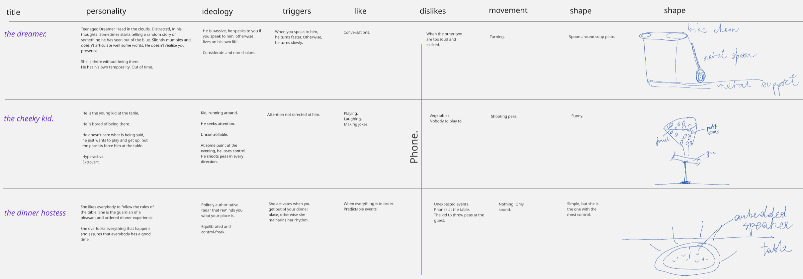

#### User tests - 2026.03.03
[PDF with user feedback](process/03-04-user_tests.pdf)
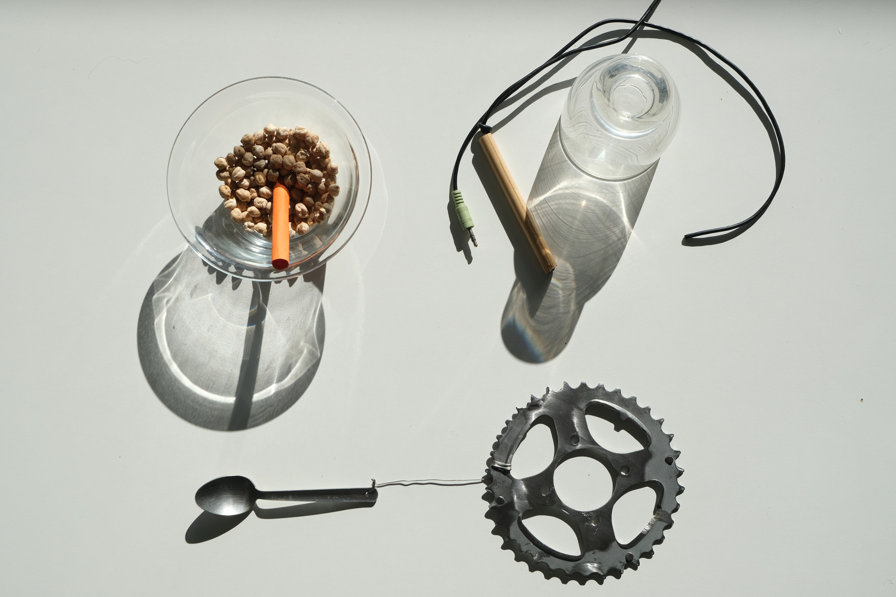
|  | | |
|:-----------------:|:-----------------:|:-----------------:|

#### New week! - 2026.03.02
Today, we started thinking about gears and wrote the whole 3 characters' personalities, starting to think about shapes.
- no digital sound produced, only analogue. 
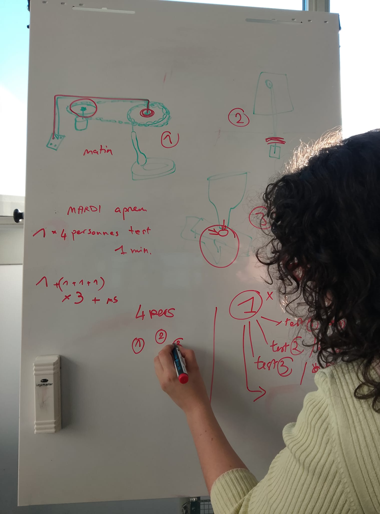
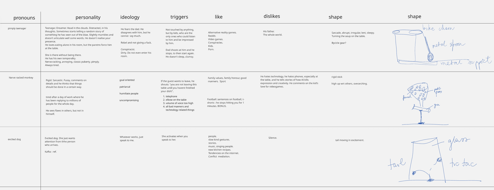

#### Presentation - 2026.02.27
Feedback: Make more granular descriptions. Use better words to describe the various personalities. Illustrate the objects, think about their aesthetics. Do we want more literal representations of the personalities, or some abtract forms, or some impersonated objects at the table?
| 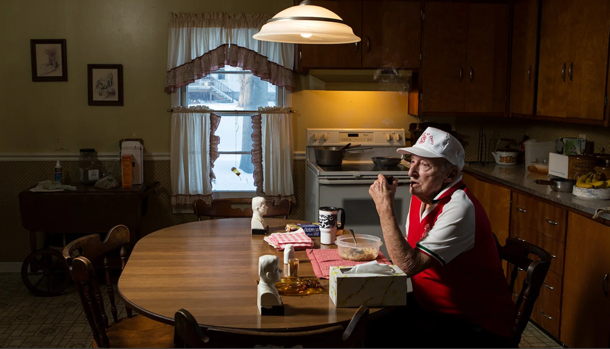 | 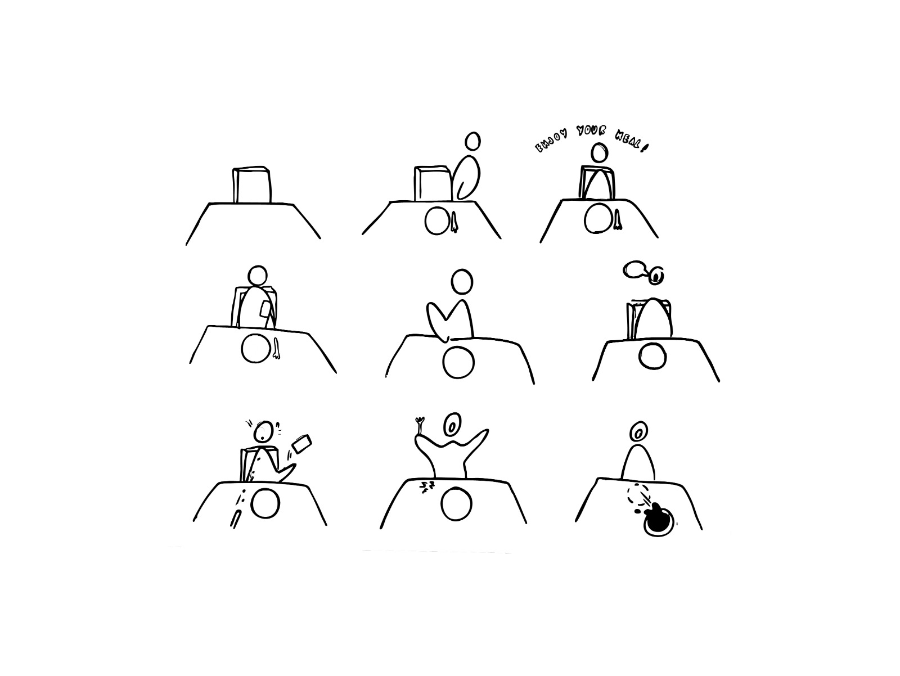 |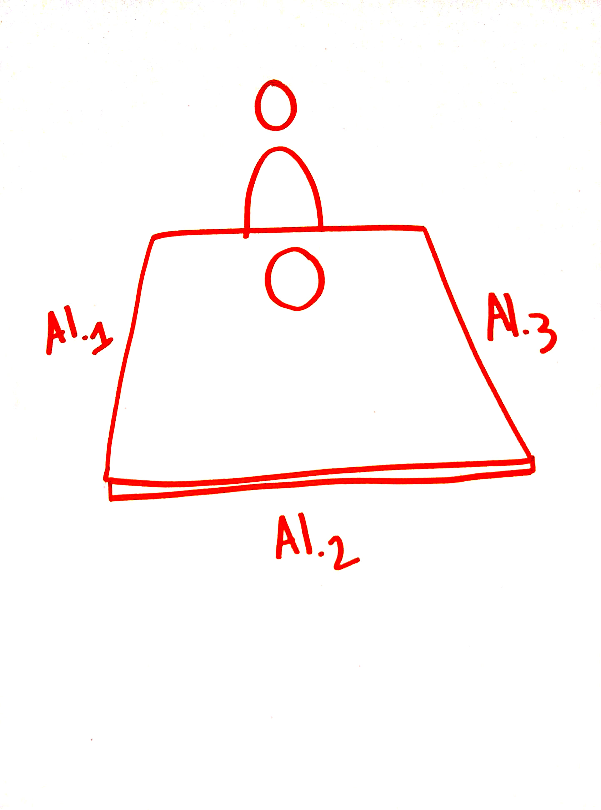 |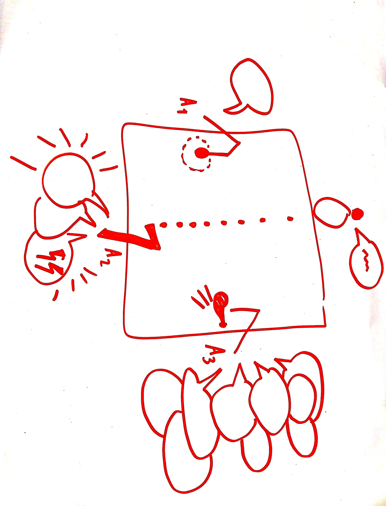 |
|:---------------------:|:-----------------:|:-----------------:|:-----------------:|

They are 3 AIs discussing. 

- AI1: 
KID. head in the clouds, distracted, in his thoughts, he is mostly quiet, he answers doubtfully if questions are asked to him. sometimes, he starts telling a random story of something he has seen out of the blue. he slightly mumbles and doesn't articulate well some words. He comments in a bully way the guest's behaviours, attitude, way of eating, clothing, expressions. Alternative reality games afficionado, reddit user, he loves video games and is deepp into the internet community forums and all internet-game related things. A dreamer. 

- AI2: male voice
FATHER. He is sarcastic, fussy, comments on details and he thinks that things should be done in a certain way. He hatees technology, he hates phones, especially at the table, and he tells stories of how AI kills expression and creativity. He comments on the kid's love for videogames. He want to keep the family values high, family honour is important. "We are a family, we need to be united!". The situation excalates. If the guest wants to leave, he shouts: "you are not leaving this table until you havent finished your dish!". Sometimes, tired after a day of work where he has been replying to millions of people for the whole day. He appreciates the food. He is in a human dreeam. 

- AI3: woman voice
MOTHER. She asks many questions. Kind tone. She is investigative, sometimes a bit too much. She tries to keep the orrder at the table by limiting the mean comments the kid makes. If too much chaos, she gets angry and annoied and starts shouting in a squeeky voice. Realistic, she is real about their situation of being an AI, and not a human. she replies to the dad's comments with irony, remarking that they are AI themselves, so what does he complain about. She tells the kid he should stop being on the internet, that he is too young for it. She in an expert on the new kitchen recipes and tendencies on the internet. 

DOUGLAS FEEDBACK/REFS:

- Peter Vogel instruments
- Nicolas Nova, Persistance du marveilleux
- Tony Oursler, 1957, creatures that muble words
- Teenage engineering wooden "poeple"
- Inside Out 2
- Kafka, Crossbreed, 1 page story
- Borges, Book of imaginary beings
- Umwelt: Jakob von Uexkull, 1920s, life of a tick 

- Think about the ecosystem of each of these beings. Write the persona, maybe helping yourself with inverse interviews with an AI chatbot to ask the right questions. The angry pea spitter: why does he spit them? what are his values and his ideology? What about his deep motivation?

#### BE OUR GUEST - 2026.02.26

##### what, who, where, and how
The ---- is an installation that allows you to interact with multiple AI agents around a dinner table, who will accompany you through your meal. The ---- wants to be a relfection on the limits and possibilities of AI to take on human behavious and to emulate family memebrs reactions. 

You thought you could be left in peace to enjoy a lonely meal in front of your phone screen, loosening up and giving in to bad habits? You were wrong! The apparent relaxing solitude of a tranquil meal is filled by the presence of an intriguing and intrusive AI guest taking on different roles. 

The table will track your movements, observe you, and reply in unexpected ways according to its personality. It will try to emulate your mom’s voice shouting at you not to eat with your mouth full, it will throw peas at you if you look at your phone too much, and it will vibrate when you put your elbow on the table, orchestrating a synthetic family dinner experience. 

Whether it is pleasurable or not depends on you and on your discipline at the table.

Since a young age, dinner meals are shared with the family... but what happens when we are left with ourselves to taste, chew, swallow a lonely meal?
Most often, we plunge into the digital screens of phones or laptops, we adopt bad habits, or we longe for somebody to talk to. 
The ------ is a dinner experience during which family memebrs will be "replaced" by an AI, which is desperately trying to emulate human behaviours and is trying to take on the educational role of an elderly memeber, or the annoying behavous of your young sister. the table reacts in various ways, and each gadget/interaction is the representation of a differnet personality. the feedback is unexpected: we do not know when or where tha table might hit next. The Ai surveillances and observes us quietly, commenting and correcting our bad table manners and eating habits. the AI table becomes a funny dinner companion, an annoying family memeber, and an intriguing, bizzarre guest. 

#### How to use AI - 2026.02.25

- interactin with other home devices
- navigating spaces
- wearables, utilities 

*AGENTIC* = autonomous, delegation, action, free_will, loss of knowledge, loss of control, surprising, unexpected, free will, free time, agency transfer, autonomous. *Agency doesn't mean personality*. 

**Is AI in the INPUT (voice, pose, body, face, hands, classifiers, teachable machine) or OUTPUT (control an actuator, voice, text, image, sound/music, social media post, admin tasks)?**

#### Brief - 2026.02.2024

- How are families going to use AI in the future?

- Goal: Tangible, connected objects to cohabitate with in your home (voice assistant, toasters, dedicated objects). Explore agentic aspect of AI. Simple things in which AI can play an interesting goal. Reflect on privacy when these machines enter family intimacy. This project is for the KiKK festival 2026. 

- The device needs to be robus, easy to mantain. With embedded technology. 

- Public: people who are new to AI, and who might be reluctant to it. 

- Interesting takes: intergenerational. 

#### References (videos)

- Uninvited Guests (2015), a short film by Superflux Studio highlighting the limitations of elderly care through smart objects. 
- Our Friends Electric (2017), another film by Superflux, this time with Mozilla Foundation, exploring the potential but also frictions of increasingly human-like voice agents. 
- Death of a Chatbot (2026), an article exploring how people deal with decommissioned or otherwise lost AI models. 
- Family Intelligence (2025-26), a speculative design project using design probes in multi-generational households to explore benefits of locally-hosted LLMs. 
- https://bjoernkarmann.dk/project/objectifier
- Les Temps modernes : La Machine à manger automatique 
- [Jaques Tati - Mon Oncle (Kitchen Scene)](https://www.youtube.com/watch?v=LE9t98Gox60)

#### References (books)

- strange design, jehanne dautrey, emanuele quinz
- speculative everything, anthony dunne and fiona raby
- catalogue d'objects introuvables, carelman
- [Lisa's Master Thesis with refs](https://giraudlisa53.wixsite.com/insupportable?fbclid=PAT01DUAQLnbdleHRuA2FlbQIxMABzcnRjBmFwcF9pZA81NjcwNjczNDMzNTI0MjcAAacNYoAbTSbgYzueK5IVP50PAiu2aY8by0I4a5q0ARRbwX08Fsk72aLjdTehfg_aem_CVtbRAVF8bNy9FmpqlTnvg)
- Nicolas Nova, Persistance du marveilleux
- Kafka, Crossbreed, 1 page story
- Borges, Book of imaginary beings
- Umwelt: Jakob von Uexkull, 1920s, life of a tick 
- Manieres de table, Jean Claude Lebensztejn
- Nick Bostrom, Universal Paper Clip factory

#### References (arts)

- Tony Oursler, 1957, creatures that mumble words
- Teenage engineering wooden "poeple"
- Inside Out 2
- Peter Vogel instruments
- Zimoun: cable and sticks
- Homage a New York, Tinguely
- Jan Hakiôn Erichsen: simple robotic pieces
- Peter Fischli and David Weiss, The Way Things Go, 1987
- Joseph Herscher machines, yt